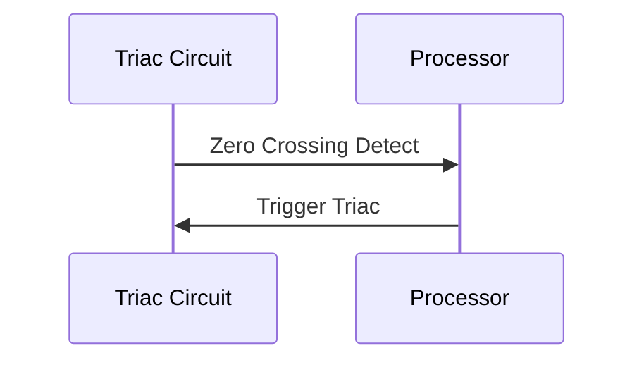

# Arduino code design for fan control
## Overview
The main fan on the coffee roaster is driven by a triac circuit that is controlled by the Arduino software to vary the speed of the fan, based on the user-controlled fan setting (0-100%). In the original version of the coffee roaster controls the heater was also controlled this way, but in Version 2 the heater is now controlled by a Solid State Relay.

There are two signal lines between the triac circuit and the Arduino processor, Zero Crossing Detect and Trigger Triac.

The Zero Crossing Detect is driven by the AC line voltage going to the triac circuit. The AC line voltage is a sine wave with a frequency of 60 Hz in North America. Each time the voltage passes through zero (each half cycle of the sine wave) the Zero Crossing Detect signal is triggered. When the processor sees this signal it starts a count which is based on the fan setting (0-100%). When the count expires the processor pulses the Trigger Triac signal which turns the triac on, thus supplying voltage and current to the fan motor. Once the triac is triggered it will stay latched on until the AC line voltage reaches zero again - the next zero crossing (that's just the way triacs work - once triggered they stay on until the supply voltage goes to zero). The longer the delay (up to one half cycle) between Zero Crossing Detect and Trigger Triac, the less of each AC cycle will be supplied to the fan motor, and the slower it will go. This is repeated each half cycle of the AC line voltage, or 120 times per second.
## Details of the implementation
The Arduino processor (Atmel ATmega328) has a number of built-in hardware features in addition to the processor core. This includes
- The ability for an external signal to interrupt the software execution and cause it to vector to an interrupt service routine (external interrupt).
- A 16-bit timer/counter (Timer 1) with two compare registers that can be used to drive an external signal when the timer reaches the count loaded into the compare register.

The triac circuit is connected to the processor as follows:

|Signal|Pin Direction|Arduino Pin|Processor Pin|Function|
|-|:-:|:-:|:-:|-|
|Zero Crossing Detect|Input|D2|PD2|External Interrupt 0 (INT0)|
|Trigger Triac|Output|D9|PB1|Timer/Counter1 output compare match A output (OC1A)|
| | | | | |

Timer 1 is initialized as followslisted in the following table. Please refer to the [ATmega328 datasheet](https://ww1.microchip.com/downloads/en/DeviceDoc/Atmel-7810-Automotive-Microcontrollers-ATmega328P_Datasheet.pdf) for a thorough description of the Timer 1 registers.
|Register|Value|Setting|
|-|-|-|
|TCCR1A|B01000000|Trigger Triac (OC1A) signal toggles on comparator match, timer set to normal counting mode (not PWM). The initialization code also ensures that the OC1A output signal is initialized to zero (logic low).|
|TCCR1B|B00000010|No capture filtering (input capture isn't used in this design), timer set to normal counting mode (not PWM), the clock prescaler is set to clk/8. The Arduino system clock frequency is 16 MHz so in this case the timer clock is set to 16 MHz/8 = 2 MHz or 0.5 microseconds per count.|
|TIMSK1|B00000010|Compare A interrupt enabled. An interrupt will occur when the timer reaches the value in the compare register (OCR1A).|
| | | 

The sequence of operation is as follows:
1. When a zero crossing is detected the External Interrupt 0 (Zero Crossing Detect) interrupt service routine sets the timer count (TCNT1) register to zero and sets the output compare register (OCR1A) to the target timer count at which it will turn on the Trigger Triac signal and cause an interrupt. It gets this target timer count from a lookup table where the index is the desired fan setting (0-100%) and the output is the target count.
2. The timer then counts up at 0.5 microseconds per count until it reaches the target value stored in the compare register (OCR1A). This causes the Trigger Triac (OC1A) signal to turn on (logic high) and the timer compare A interrupt to occur.
3. The timer compare A interrupt service routine waits for a brief period to provide the minimum pulse width to trigger the triac, then turns off the Trigger Triac signal (logic low). The cycle then repeats at step 1.

