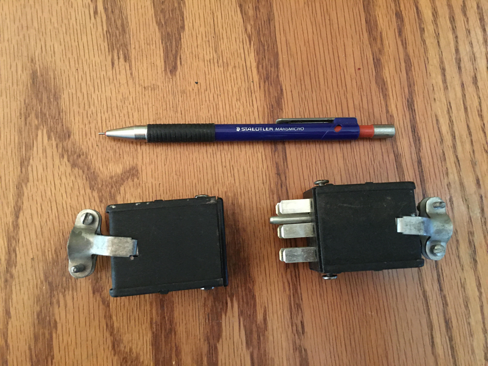
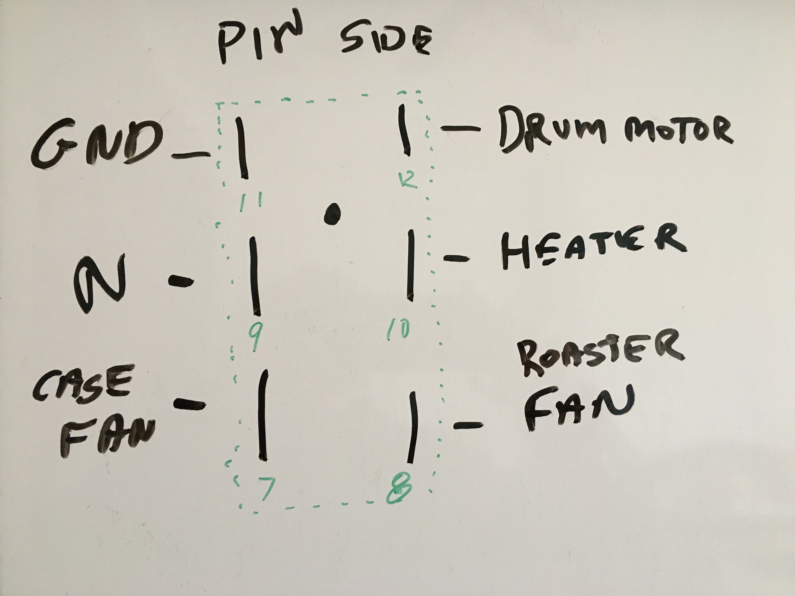
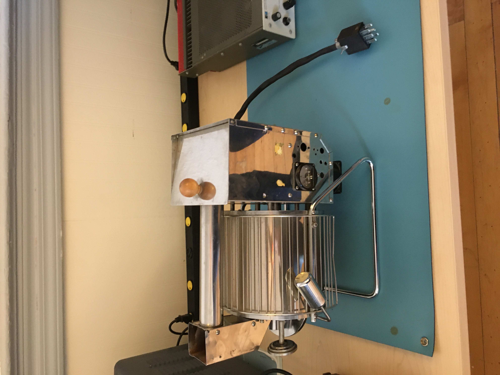

# Coffee Roaster V2
## Background
This project is a redesign of the coffee roaster controls that were implemented over a decade ago. In that previous design, the low level control circuits were installed within the coffee roaster itself. Years of operation in the elevated temperatures combined with dust from the roasting process have made maintenance of the circuits difficult at best, not to mention the tight fit of these circuits within the roaster.

## Project Goals
The idea for this project is to move all of the control circuitry to an external enclosure, and to update where it makes sense to more modern components. Adding a built-in touch panel display to do the high level control functions is also desirable.

## Design

The first challenge this presents is the interface between the coffee roaster and the external enclosure. There are several high voltage and in some cases high current connections that need to be made. Obviously it would be good to keep this interface as simple as possible and not have a multitude of connections to make between the roaster and the electronics enclosure. Luckily a connector set was found at the Huntsville Hamfest that is pretty much ideal for this.

This connector should allow us to have only two connections between the roaster and enclosure, this connector and a thermocouple to measure the temperature of the roaster.

The pins of these connections are assigned as follows.

Notice that the pins are numbered 7-12. These numbers are molded into the connectors next to the pins. I have no idea why they chose 7-12 as the pin numbers, I can only assume there was another connector with pins 1-6.

You can also see the locating pin on the connector. I originally thought this would be a ground pin as would be the case in a standard 3-prong US outlet. That is not the case however. The male connector has a connection for that pin but it is not connected to anything on the female connector. I connected it to ground in any case.

I included connections for the roaster drum motor and case fan. In the previous design these were always on whenever the roaster was powered. This will give us the capability to control these functions if desired.

The roaster was then modified to remove the previous control circuitry and install wire the new connector.



