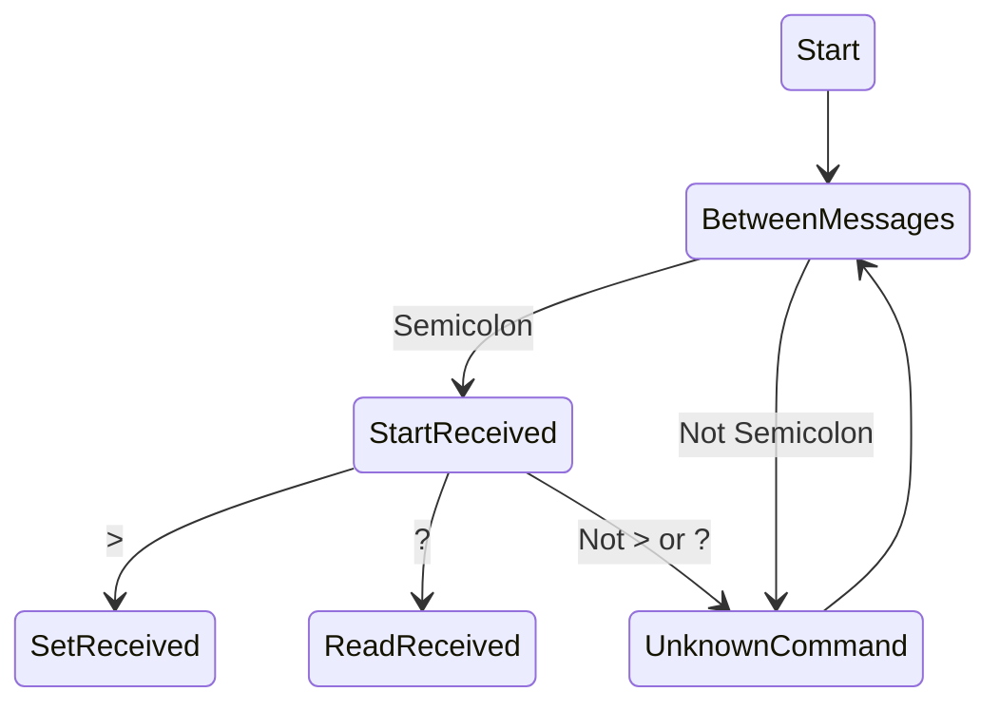

# NSE Coffee Roaster V2
## Serial protocol state machine (Arduino)

```mermaid
  stateDiagram-V2
      Start --> BetweenMessages
      BetweenMessages --> StartReceived : Semicolon
      BetweenMessages --> UnknownCommand : Not Semicolon
      UnknownCommand --> BetweenMessages
      StartReceived --> SetReceived : >
      StartReceived --> ReadReceived : ?
      StartReceived --> UnknownCommand : Not > or ?

      
```